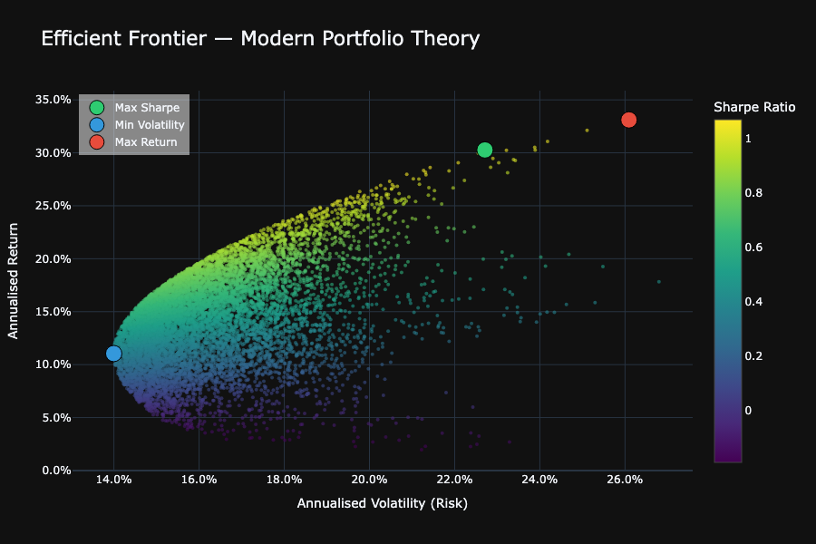

# 📊 MPT Portfolio Optimizer

A Python-based **Modern Portfolio Theory (MPT)** optimizer that constructs the efficient 
frontier for any user-defined set of US or Indian stocks and ETFs. Built as the third 
project in a quantitative finance portfolio series, completing the trilogy of 
**performance measurement → factor analysis → portfolio construction.**

---

## 📌 What This Project Does

Given a set of tickers and a date range, the optimizer:
- Downloads historical price data via `yfinance`
- Computes annualised historical returns and a full covariance matrix
- Runs a **Monte Carlo simulation** of 10,000 random portfolios to map the efficient frontier
- Identifies three optimal portfolios across the risk/return spectrum
- Visualizes results interactively via **Plotly** with hover-over portfolio details

---

## 📈 The Three Optimal Portfolios

| Portfolio | What It Optimizes | Best For |
|---|---|---|
| ⭐ **Max Sharpe Ratio** | Highest return per unit of risk | Most investors |
| 🔵 **Min Volatility** | Lowest possible portfolio risk | Conservative / risk-averse investors |
| 🔴 **Max Return** | Highest raw historical return | Aggressive investors |

> **Note:** The Max Return portfolio is calculated directly (not via simulation) and will 
> typically concentrate 100% in the single best performing asset — return is maximized 
> but diversification is fully sacrificed.

---

## 🖼️ Sample Output



---

## 🧠 Methodology

### Returns
Expected returns are computed as **annualised historical mean returns** — the average 
daily return scaled by 252 trading days. These are backward-looking estimates, not 
forward-looking forecasts.

### Risk
Portfolio volatility is derived from the **annualised covariance matrix** of daily returns. 
This captures both individual asset variance and cross-asset covariance — the mathematical 
foundation of MPT's diversification benefit.

### Optimization
- **Monte Carlo simulation** generates 10,000 random weight combinations, each summing to 
100%, to map the empirical efficient frontier
- **Max Sharpe** and **Min Volatility** portfolios are identified from the simulation results
- **Max Return** portfolio is solved directly via `numpy.argmax` on mean returns — not 
approximated via simulation — ensuring it always correctly identifies the highest returning 
single asset

### Sharpe Ratio
Sharpe Ratio = (Portfolio Return − Risk-Free Rate) / Portfolio Volatility

## ⚠️ Important Limitations

- **Historical ≠ Expected:** Returns are based on past price data. Past performance does 
not guarantee future results.
- **Currency mixing:** This tool supports **either US or Indian stocks** in a single run. 
Mixing both is not recommended — USD and INR returns are not currency-adjusted, which 
produces misleading optimization results.
- **Long-only, no leverage:** The optimizer assumes standard long positions with weights 
between 0% and 100% summing to 1.
- **Monte Carlo approximation:** Simulation surfaces the empirical frontier but does not 
guarantee the mathematically exact optimal point. For exact optimization, convex solvers 
such as `scipy.optimize.minimize` can be used as a future extension.

---

## 🛠️ Tech Stack

| Library | Purpose |
|---|---|
| `yfinance` | Historical price data download |
| `NumPy` | Matrix math, covariance calculations, Monte Carlo simulation |
| `Pandas` | Data handling and returns computation |
| `Plotly` | Interactive efficient frontier visualization |

---
## 📂 Project Structure
mpt-portfolio-optimizer/
│
├── mpt_optimizer.ipynb       # Jupyter Notebook (step-by-step)
├── app.py                    # Streamlit web app (coming soon)
├── requirements.txt          # Dependencies
└── README.md

---

## ▶️ How to Run Locally

### 1. Clone the repository
```bash
git clone https://github.com/yourusername/mpt-portfolio-optimizer.git
cd mpt-portfolio-optimizer
```

### 2. Install dependencies
```bash
pip install -r requirements.txt
```

### 3. Launch Jupyter Notebook
```bash
jupyter lab
```

### 4. Run all cells sequentially and enter inputs when prompted:
- **Tickers** — US: `AAPL, MSFT, GLD` or Indian: `RELIANCE.NS, HDFCBANK.NS`
- **Risk-free rate** — e.g. `5.25` for 5.25%
- **Date range** — e.g. `2020-01-01` to `2024-01-01`

---
## 📜 Disclaimer

This tool is for **educational and informational purposes only** and does not constitute 
financial advice. Always consult a qualified financial professional before making 
investment decisions.
